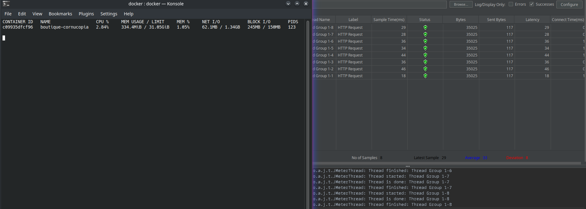
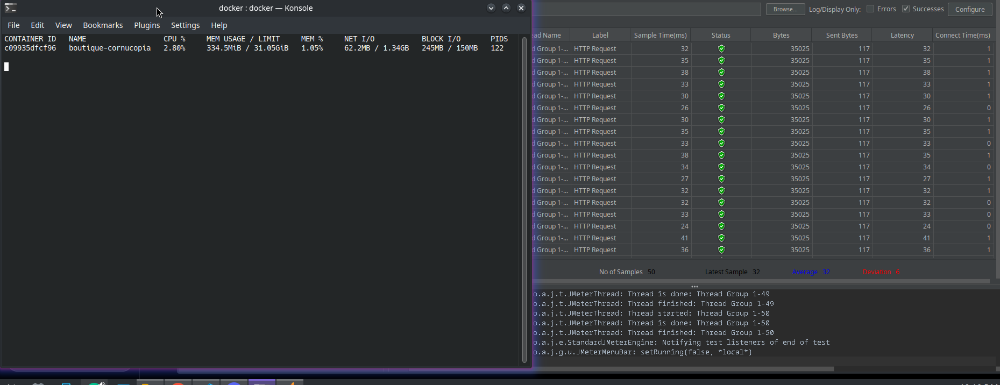

# NOTES
- DB_NAME=cornucopia
- DB_USER=flora
- DB_PASSWORD=potager-2026

# jmeter

| secondes mesure | CPU du conteneur (docker stats) | temps moyen de réponse (seconde)
| --- | --- | --- |
| 10 secondes | 2.84% | 0.033s
| 60 secondes| 2.80% | 0.032s
## 10 secondes :

## 60 secondes :

note: je ne comprends pas